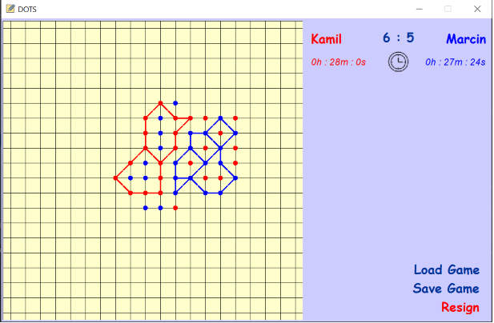

# DotsTheGame
Dots - an abstract strategy game. Written in Java with Swing GUI.

## Description
The primary target of dots is capturing enemy dots by surrounding them with a continuous line of one's own dots.
Dots is played on a grid of some finite size. Players take turns by placing a dot of their own color (usually red and blue) on empty intersections of the grid. The goal of the game is to capture more dots than opponent.
Game description and rules can be found under the link: https://en.wikipedia.org/wiki/Dots_(game).

## Settings
1. The application allows to set up a square shaped grid of sizes between 10 and 40.
2. Each player can select its own distinct dots color.
3. Each player has its own timer (available time can be set up in the settings). When this timer runs out the game is lost.
4. Each player can set up its own name;
5. Every game can be saved and loaded later on (serialization).

## Challenge
The main challenge of this application was to find cycles which surround opponent's dots. Such cycles are called bases and need to be drawn on the game board. All of this must be conducted in compliance with game rules. Cycles are being found recursively. To solve this problem graph theory was used: https://en.wikipedia.org/wiki/Graph_(discrete_mathematics). 

## Board View
Sample game with score board:

## Testing
Extensive manual tests (using GUI) were conducted. Further tests were done with JUnit4 library. Simplified Mock board was created with sample game which represented common cases of bases creation. Actual score was compared against expected score for situations where one player's dots were locked.

Feel free to try out and enjoy;)
